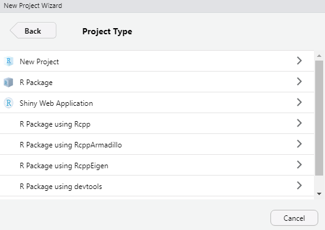
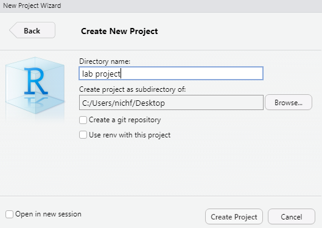

```{r, include=FALSE}
knitr::opts_chunk$set(echo = TRUE, fig.align="center")
```

In this lab you are going to use real data and try out a few different "machine learning" approaches. We are going to use machine learning to do three things: Classification, Regression, and Cluster analysis.


This lab covers a lot of material and I do not expect you to finish the entire thing. The purpose is to expose you to the basic tools used in machine learning and data analysis. 


## Data
You will be handling three types of data:

* SFMTA bicycle count data: These are data from loop detectors that the City of San Francisco uses to collect bicycle traffic. We can assume that these sensors count every bicycle that passes by, but from a fixed point.

* Streetlight Inc. zone-based bicycle counts: These data are collected from tracking mobile apps (Strava, GoogleMaps, etc.) in a spatial zone and aggregated. These provide counts for much larger zones across the city, but only provide a tiny sample (about 1%) of the total trips. To complicate things more, the counts are highly biased by the people tend to use the apps (e.g., recreational cyclists and not commuters), so the proportion in one place can differ severely from another.

* Landuse Zoning data: These data provide land usage numbers based on the proportional area for the different land use types the City designates.

## Objective

You have three objectives:

1. Extrapolate a sample (regression): The tiny sample provided by Streetlight is interesting, but the statistically unreliability makes it fairly useless for practical purposes. Your goal is to use the fixed counter locations and the land use data, to extrapolate the samples to full counts as best you can.

2. Fill in missing data (Classification): Let's pretend that we accidentally lost the time of day label for a portion of the data and it needs to be filled in.


3. Uncover traveler groups (Clustering): City planners would like to know which areas and types of people are bicyclists so they can put bike lanes in places that will get used the most. 


## Software

In this lab we will be using *R* and RStudio. *R* is an open source programming language and software environment dedicated to statistical data analysis. There are a variety of programming languages and software capable of machine learning, such as Python, SAS, SPSS, Matlab. However, *R* is free and easy to use.  


*R* base libraries can be downloaded here:
[https://cran.rstudio.com/bin/windows/base/R-4.0.4-win.exe](https://cran.rstudio.com/bin/windows/base/R-4.0.4-win.exe)

RStudio IDE can be downloaded here:
[https://rstudio.com/products/rstudio/download/#download](https://rstudio.com/products/rstudio/download/#download)


## Getting started
After installing *R*-base and RStudio, launch RStudio. RStudio will have four window panes. You can customize them, but the default is something like this:

{width=50%}

The "Source" pane is where you type your *R* script. *R* is capable of handling a variety of source codes, Python, C++, HTML, RMarkdown (what I used to create this document), etc. The console allows you to type commands to the underlying *R* session for immediate results, this is useful for testing things or having the data print to screen. The two panes on the right allow you to visually explore the project files and packages, view the current state of variables in *R*, and view plots.


## 1. Create a new project

Next you are going to create a new project. A "project" is basically a folder containing all the `.R` code and any other relevant files. By creating a project, RStudio creates a `.Rproj` file in a root folder which tells *R* where to find everything related to this project. I like to keep my projects organized with sub-folders, maybe something like:

```
project  
    |- data  
    |- doc  
    |- plots  
    |- output  
    |- src 
```
{width=40%}

## 2. Name your project
If you already created a folder using your OS, you can use that, or you can have RStudio create a new one.


{width=40%}


## 3. Create your first R script file

Create a new R script, name it whatever you like. 

{width=40%}


## 3. Install packages 
After you've installed RStudio, let's begin by installing some of the necessary packages. A package is essentially an *R* project with useful tools that someone "packaged" up for public use. It is similar to python's pip install and module import system.

You only need to install them once, after that you just need to "activate" it. So you can type these into the console (rather than re-installing it each time in the R script):

```{r eval=FALSE}
install.packages('data.table')
install.packages('ggplot2')
install.packages('rpart')
install.packages('randomForest')
install.packages('glmnet')
install.packages('caret')
install.packages('nnet')
install.packages('factoextra)
#Do this for any other missing package
```

Most of the following packages are related to specific machine learning techniques. However, two packages I highly recommend. `data.table` and `ggplot2`. `data.table` is a alternative to the basic DataFrame object that *R* uses. It is more or less the same was developed using C++ for higher performance and very useful shorthand commands. `ggplot2` makes beautiful plots beyond what the basic *R* plot function. Alright, now lets get started by activating the packages:

```{r message=FALSE}
library(data.table)    # Faster alternative to DataFrames
library(ggplot2)       # Pretty plots
library(factoextra)    # PCA plotting
library(rpart)         # Simple regression trees
library(randomForest)  # More advanced trees, with prediction!
library(glmnet)        # Suite of feature selection tools
library(caret)         # Suite of ML tools
library(nnet)          # neural net tools
```


# Data pre-processing
## 1. Import the data
To get started we can import the data. To avoid overwhelming you with trivial data filtering tasks, I've gone ahead to preprocess these files for this project. But if you're curious, I have included a script in `preproccess.R`. Also note that I use the command `fread` rather than the base-*R* `read.csv`. It performs the same task but significantly faster, and it imports as a data.table object rather than a DataFrame. 

```{r}
relates <- fread("./data/relation.csv")
counts_sf <- fread("./data/sfmta_counts_monthly.csv")
counts_sl <- fread("./data/streetlight_counts_monthly.csv")
landuse <- fread("./data/landuse.csv")
infra <- fread("./data/bikeinfra.csv")
```

We can inspect the data in the console by typing `head()`. The head command just prints the first 6 rows by default, but you can specify otherwise. Since some of these data sets are really wide with many columns, I'm going to only look at the first few. You can also see the syntax to subset the data as DataFrame[rows, columns]

The `counts_sf` data are the SFMTA's fixed location bike counts, summarizing the average bicycle count. It's just the total count per time stratification per peak-hour (e.g., all day, early am: 12am-6am, peak-am: 6am-10am, mid: 10am-3pm, peak pm: 3pm-7pm, late pm: 7pm-12am), per weekday or weekend, and per month. 

The `count_sl` data are Streetlight Inc.'s count data which offers the same time stratification, but also has a slew of interesting traveler data. It has the percentage of travelers per income group, education level, ethnicity, and also whether they have kids.

The `landuse` file provides the residential units per acre and the percentage non-residential space utilized for each purpose. This includes:

* SHAPE_Area = TAZ size in acres
* CIE = Cultural, Institutional, Educational in sq-ft per acre
* MED = Medical in sq-ft per acre
* MIPS = Office (Management, Information, Professional Services) in sq-ft per acre
* PDR = Industrial (Production, Distribution, Repair) in sq-ft per acre
* RETAIL/ENT = Retail, Entertainment in sq-ft per acre
* VISITOR = Hotels, Visitor Services in sq-ft per acre
* RESUNITS = Residential units per acre

The `bikeinfra` file has the linear length of bike lanes by class in each TAZ.

Lastly, the `relates` data is a relationship file that relates the SFMTA's bike count locations to the traffic analysis zones (TAZs). Note that this is not a one-to-one relationship. If you were to inspect this file in more detail, you'd find that there there can be multiple counter locations per TAZ. This is called a many-to-one relationship. Since each TAZ contains multiple records per TAZ and each sensor contains multiple records per TAZ, it becomes a pretty messy many-to-many relationship. 

## 2. Aggregate and merge data

First we merge the relationship to the SFMTA counts so that we can merge the streetlight data.
```{r}
# First we merge the TAZ to sensor relationsip by counter id
counts_merged <- merge(relates, counts_sf, by="counterid")
# Next we merge this SFMTA to Streetlight data using TAZ id + other variables
counts_merged <- merge(counts_merged, counts_sl, 
                       by=c("taz_id", "day_type", "day_part", "month"), all=F)
#Then merge landuse by TAZ
counts_merged <- merge(counts_merged, landuse, by='taz_id')
#Last, we merge bike infrastructure by TAZ
counts_merged <- merge(counts_merged, infra, by='taz_id')

```

The merge function takes two data frames and merges them by the unique identifier. You have to be explicit about what you're doing because if a match cannot be found it will either drop it or include blank `NA` values. You also can't have duplicate ID's in both dataframes. If one has multiple, it'll copy the matched rows to each, but if both have multiples it doesn't know which goes where. That's why in the second merge there are multiple "by" columns specified to match by.


## 3. Feature Extraction
Feature extraction can be very nuanced. It is important to understand what you're trying to achieve. For example, in detecting mis-configured HOV lane traffic sensors, we know that we would normally expect very few people to bother using the HOV lane at 2am. Thus, a useful feature is average traffic flow between 1-3am. In this project I've already done most of the extraction for you through GIS.


## 4. Scaling & normalization

Here I will normalize the Streetlight Inc. count and the length of bicycle infrastructure by the TAZ size. We can also remove extra columns we don't need using the `!` symbol, which denotes *not*, or the inverse.

```{r}
# Columns to remove
counts <- counts_merged[, !c('taz_id','counterid','lat','location','lon'), with=F]
# Convert to factor as opposed to open ended character variable.
counts$day_part <- as.factor(counts$day_part)
# Exclude any rows with NA in the count.
counts = counts[!is.na(sfmta_count) & !is.na(strtlght_count),]
# Normalize street light counts by TAZ area (simple form of feature extraction)
counts$strtlght_count <- counts[ , strtlght_count / SHAPE_Area]
# Normalize bike infra by length per TAZ area (simple form of feature extraction)
infra_cols <- c('CLASS_I','CLASS_II','CLASS_III','CLASS_IV')
counts[ , infra_cols] <- counts[, lapply(.SD, function(x) {x / SHAPE_Area}), 
                                .SDcols = infra_cols]
```

One thing to be careful of are the relative scales of your input data. We generally want our numeric values to be on a similar scale. If one variable ranges up to 1000 and the other is between 0 and 1, that's a problem. If we tried to build a model from this, the large values would end up drowning out the smaller ones. In our data set we have a mix of counts, percentages, and proportional areas; all at vastly different scales. One simple scaling technique is to use Z-scores, you might remember these from statistics. This sets everything to be relative to its own mean, centered on 0. Since the input data does not need to be human interpretable, just statistically predictive, then this is a good way to go. It's calculated as $\text{Z-score} = \frac{x - \mu}{\sigma}$. *R* has a built in function `scale`, but for posterity we'll do it the old fashioned way. Another popular normalization function is the MinMax function, this normalizes everything to between 0 and 1, rather than a Z-score which can be negative.

```{r}
minmax <- function(x) ( x - min(x) ) / ( max(x) - min(x) )
z_score <- function(x) (x-mean(x))/sd(x)
#Scale all columns EXCEPT these
z_cols <- !(colnames(counts) %in% c('sfmta_count', 'day_type','day_part','month'))
z_cols <- colnames(counts)[z_cols]

#Get scaled z-score for everything
counts_scaled <- counts
counts_scaled[ , z_cols] <-  counts_scaled[ , lapply(.SD, z_score), .SDcols = z_cols]

```

Note the `sfmta_count` variable. Typically you don't need to scale your target variable.


# Conventional Analysis

Now that the data is merged, we can plot it to see what it looks like in a simply X~Y scatter. If the Streetlight Inc. data were an ideal sample that was just proportionally smaller (e.g., Streetlight is just a perfect 1% sample of trips), then we would see a linear relationship between the two and all we need to do is multiply Streetlight counts by the scaling value to get the full count. However, if there is any bias, it will cause the relationship to skew and distort.

```{r xy, fig.height = 3, fig.width = 4}
#Lets plot it an see what it looks like
plot(y=counts$sfmta_count, x=counts$strtlght_count,
     ylab="SMFTA Count", xlab="Streetlight Count")
abline(lm(sfmta_count~strtlght_count, data = counts_scaled))

```

Clearly the basic regression model does not fit at all, showing the raw Streetlight Inc. data is not a perfect sample and there are a lot of unaccounted biases.


## Generalized Linear Models
A conventional approach might try to account for these biases in a multiple regression model. *R* can run a regression model using `lm()`, or `glm` for generalized models. The formula syntax is like this y~x1+x2 for a model like $Y=X_1+X_2+...X_n$. `glm` and a host of other packages in *R* allow for a variety of complex regression models, such as random intercepts, random slopes, and other multilevel models. For now, to simply include all columns as $X$ variables we use the "`.`" syntax, like "`y ~ .`". But expect terrible results if you are blindly dumping data in. For example:

```{r GLM, results = 'hide'}
#Linear model
lmfit <- glm(sfmta_count~., counts_scaled, family = 'gaussian')
R2 <- (1-(summary(lmfit)$deviance / summary(lmfit)$null.deviance))

summary(lmfit) #prints the results to the console
```
We can approximate the $R^2$ goodness-of-fit measure as $1 - \frac{model~deviance}{null~deviance}$, which in this case yields an $R^2$ of `r round(R2,2)`, which is pretty mediocre at best, and most of the variables are insignificant. However, if our goal was purely social research we could at least use it to identify which factors significantly affect bicycle demand. Statistical significance in the model is basically a hypothesis test of the predicted line slope. Essentially asking, is the standard error from our estimated slope small enough that it is part of the sample data? 

### Question 1: Which variables did the model identify as significant?
$~$
$~$
$~$
$~$
$~$

# Data Mining

We can refine these results through some sort of variable selection procedure (e.g., step-wise regression or LASSO) to remove extraneous variables. While this is useful for analysis, it is also incredibly important for computational performance of machine learning. Dumping a bunch of data into a model could take forever to compute and yield little benefit. It is important to reduce the data to only the most important features. We can do this through Feature Selection and Feature Extraction. 
 
### Feature Selection
Rather than testing variables one by one, feature selection can be automated. Here's a quick example using "elastic net" from the `glmnet` package. More on this here: https://web.stanford.edu/~hastie/glmnet/glmnet_alpha.html
Elastic net is a combination of LASSO and Ridge regression. 

```{r fig.height = 3, fig.height = 3, fig.width = 4}
# Model Matrix
mm <- model.matrix( ~ .,  data = counts_scaled[,!'sfmta_count'])

cv.glmmod = cv.glmnet(x=mm, y=counts_scaled$sfmta_count)
plot(cv.glmmod)
```

This is the mean-squared error as the regularization parameter varies. Basically as the regularization parameter increases, more variables get removed. At first, removing variables as only a small impact on accuracy, but eventually it starts having a big impact. `glmnet` uses the first standard deviation to determine the maximum $\lambda$ before error gets too large. We can extract variables from that:

```{r, results='hide'}
lambda = cv.glmmod$lambda.1se # the value of lambda used by glmnet default
coefs = as.matrix(coef(cv.glmmod)) # convert to a matrix
ix = which(abs(coefs[,1]) > 0)

print(coefs[ix,1, drop=FALSE])
```
### Question 2: Which variables did the elastic net keep? Do these differ from significant variables in Question 1?
$~$
$~$
$~$
$~$
$~$


### Feature Extraction
A typical feature extraction is done using Principal Component Analysis (PCA). PCA is like a matrix of covariance matrices, essentially it compares the relationship for every variable combination so all dimensions can be viewed in two dimensions, allowing us to more evaluate which variables are more important.


```{r PCA, results='hide', fig.height = 3, fig.width = 4, warning=FALSE, message=FALSE}
pca_analysis <- prcomp(counts[,-1:-3], center = TRUE, scale. = TRUE)
summary(pca_analysis)
fviz_eig(pca_analysis)
fviz_pca_var(pca_analysis,
             col.var = "contrib", # Color by contributions to the PC
             repel = TRUE     # Avoid text overlapping
             )
```

A really cool byproduct of PCA is that it allows to to reduce the data without eliminating variables (like with feature selection). We can take the matrix build a predictive model from it. The input data is less interpretable, but if our objective is prediction and not analysis, that's fine. 

```{r PCA_dataframe}
counts_pca <- data.frame(sfmta_count = counts_scaled$sfmta_count, pca_analysis$x)
```


# Machine learning

In the following sections we will do unsupervised clustering, supervised classification, and supervised regression. 

## 1. Unsupervised learning - Clustering
Decision trees can be used to identify the different types of groups in the data relative to your response variable. Here we can inspect the different type of land use groups relative to the bicycle counts.

```{r treepart, results='hide', fig.height = 3, fig.width = 4, cache=TRUE}
# grow tree
tree_place <- rpart(strtlght_count ~ 
                      RESUNITS+CIE+MED+MIPS+RETAIL+PDR+VISITOR+
                      CLASS_I+CLASS_II+CLASS_III+CLASS_IV,
                    method="anova", data=counts)

printcp(tree_place) # display the results
plotcp(tree_place) # visualize cross-validation results
summary(tree_place) # detailed summary of splits
```

```{r treeplot, fig.height = 3, fig.width = 4}
library(rpart.plot)
rpart.plot(tree_place)
```

Each branch is a group. We have 4 distinct groups. From left to right, we can label them as the 1) Non-retail zones, 2) Retail zones, 3) Residential zones, and 4) Office zones. 

### Question 3: Do these land use groups result in increasing bike counts? Explain.
$~$
$~$
$~$
$~$
$~$

## 2. Supervised learning -- Classification
For predictive supervised models, we need to separate our "training" data that we used to build the model; and our "testing" data which use to test the prediction results.

```{r}
#Partition the data
index = sample(1:nrow(counts_pca), 0.8*nrow(counts_pca)) 
train = counts_scaled[index,] # Create the training data 
test = counts_scaled[-index,] # Create the test data
```

### Random forest
For classification our target variable is `day_part`.

```{r RFclass, fig.height = 3, fig.width = 4, cache=TRUE}
#Lets also scale the sfmta_count variable
rf_class <- randomForest(day_part ~ ., data=train, ntree=10, type = 'classification')

test$rf_day_part <- predict(rf_class, newdata=test)

confMat <- table(test$day_part, test$rf_day_part) 
accuracy <- sum(diag(confMat))/sum(confMat)

print(confMat)
```

True predictions should fall along the diagonal, which it does for the most part. Not bad, but not spectacular.

### Question 4: What was the prediction accuracy in %?
$~$
$~$
$~$
$~$
$~$


## 3. Supervised learning -- Regression


Now let's try regression prediction. Instead of trying to classify things, we're trying to predict a number. 

### Random forest

```{r RFreg, cache=TRUE, results='hide', fig.height = 3, fig.width = 4}
rf_reg <- randomForest(sfmta_count ~ ., data=train, ntree=10, type = 'regression')

test$rf_count <- predict(rf_reg, newdata=test[,!'rf_day_part'])

lm_rf <- lm(rf_count~0+sfmta_count, data=test)
summary(lm_rf)
plot(test$sfmta_count, test$rf_count)
abline(lm_rf)
```

It is not perfect, but it is an improvement in prediction power compared to dumping data into `glm`. For kicks, let's try Neural networks. Neural Networks tend to require a bit more tuning, so I don't expect much right away.


### Neural Net

```{r NN, message=FALSE, results='hide', fig.height = 3, fig.width = 4, cache=TRUE}
#Neural Net
# Set trace=T if you want to check progress in the console
# Size are the number of hidden layer nodes
nnfit <- nnet(sfmta_count ~ ., data=train, size=10, maxit=10000, trace=F, linout=T)
test$nn_count <- predict(nnfit, newdata=test)

lm_nn <- lm(nn_count~0+sfmta_count, data=test)
summary(lm_nn)
plot(test$sfmta_count, test$nn_count)
abline(lm_nn)
```
Overall it seems like both worked pretty well at improving the prediction accuracy. Of course, the results could be greatly improved with refinement. But for a quick rundown, results are not bad.

### Question 5: Based on the $R^2$, which performed better? Random Forest or Neural Networks?
$~$
$~$
$~$
$~$
$~$


